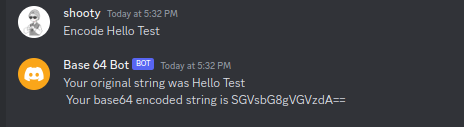
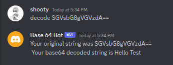

# Discord Bot written in Rust

A discord bot to help you encode and decode Base64 strings

After inviting the discord bot to your server, you can DM the bot.

`<Method> <Text>`

For example

`Encode Hello Test`

`Decode SGVsbG8gVGVzdA==`

Point to note: Base64 uses `=` for padding only padded encoded strings will work

Use the following link to add it to your server!
\
 https://discord.com/api/oauth2/authorize?client_id=1145238972696625153&permissions=0&scope=bot
